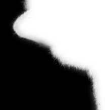

# Guided Image Filtering
Guided Image Filtering uses a guided filter which can be used as an edge-preserving smoothing operator similar to the popular bilateral filter but with better behaviour near edges. It can be also be used to transfer the structures of the guidance image to the filtering output for applications like dehazing. Here we analyzes the performance of guided image filtering on various application like in Noise Removal, Image Enhacement, Structure Transfer and Flash/No-Flash Denoising. It also helps in improving segmentation labeled output.

## Repository consists of:
  - Report with algorithm and mathematical derivation of Guided filter.
  - The Jupyter notebook consists of a scratch implementation of a Guided filter for Gray-scale and RGB images.
  - The Jupyter notebook is also discussing the various application of the Guided filter with the result

## Result analysis:
<table>
  <tr>
    <th> Application </th> <th> Parameter </th> <th> Guidance Image </th> <th> Input Image </th> <th> Guidance output Image </th>
  </tr>
  <tr>
    <td>  Noise removal in Grayscale Image </td>
    <td>  r = 21   &epsilon; = 0.001 </td>
    <td>  </td>
    <td>  </td>
    <td>  </td>
  </tr>
  <tr>
    <td>  Noise removal in RGB Image </td>
    <td>  r = 41   &epsilon; = 0.032</td>
    <td>  </td>
    <td>  </td>
    <td>  </td>
  </tr>
  <tr>
    <td>  Structure transfer filtering </td>
    <td>  r = 41   &epsilon; = 0.0045</td>
    <td>  </td>
    <td>  </td>
    <td>  </td>
  </tr>
  <tr>
    <td>  Flash/No-Flash Denoising </td>
    <td>  r = 15   &epsilon; = 0.003</td>
    <td>  </td>
    <td>  </td>
    <td>  </td>
  </tr>
  <tr>
    <td> Image Enhancement </td>
    <td>  r = 61   &epsilon; = 0.0001</td>
    <td>  </td>
    <td>  </td>
    <td>  </td>
  </tr>
  <tr>
    <td> Improve semantic segmentation </td>
    <td>  r = 21   &epsilon; = 0.08</td>
    <td>  </td>
    <td>  </td>
    <td>  </td>
  </tr>
  </table>
  
  @author:
  - Kishan Vaishnani
  - Dhyanil Mehta 

  #### Referece:
  - He, Kaiming, Jian Sun, and Xiaoou Tang. "Guided image filtering." IEEE transactions on pattern analysis and machine intelligence 35.6 (2012): 1397-1409.
  
  
